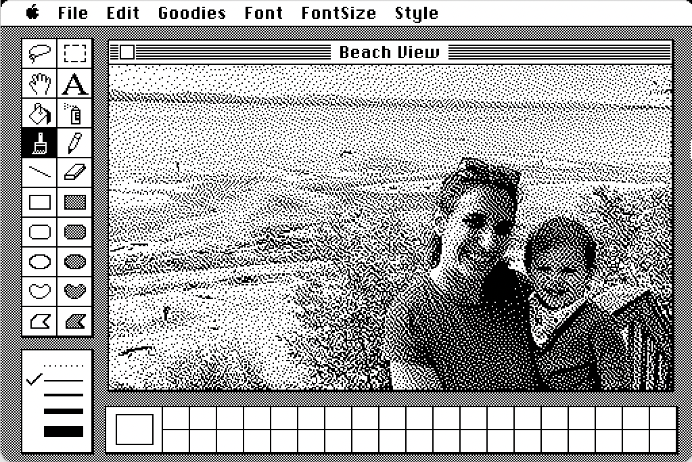
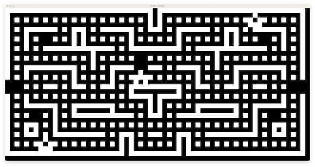
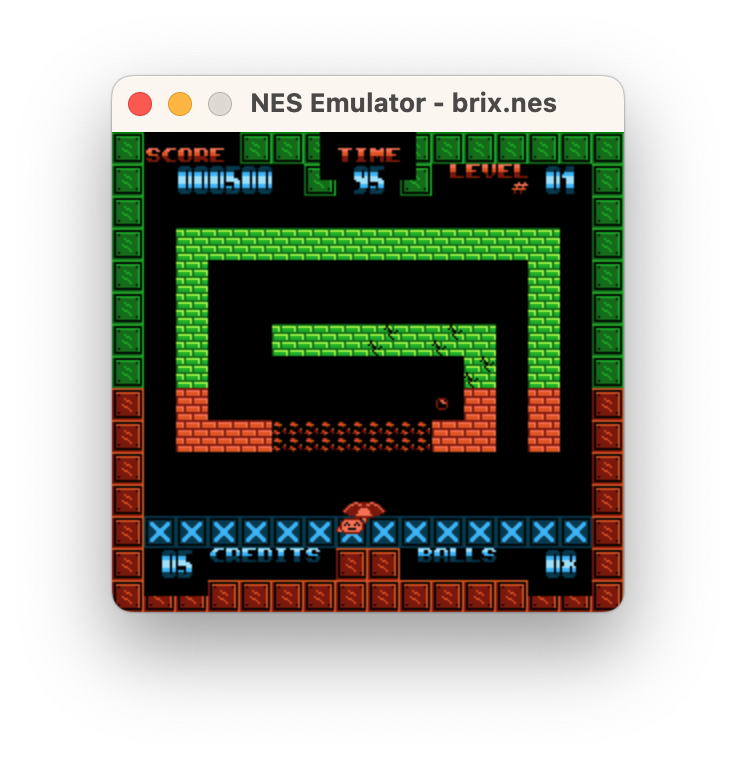
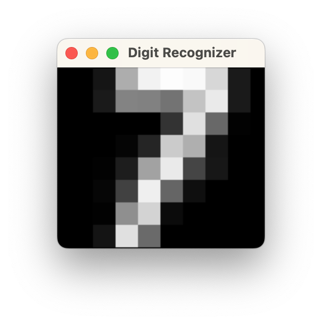

# Computer Science from Scratch

This repository contains all of the source code for the book *[Computer Science from Scratch: Building Interpreters, Art, Emulators and ML in Python](https://nostarch.com/computer-science-from-scratch)* by [David Kopec](https://davekopec.com) and published by No Starch Press. The book, intended for intermediate to advanced Python programmers, features 7 projects of varying complexity from the realm of interpreters, emulators, computer art, and simple machine learning. In the table below is a description of the 7 projects and further down in this README there are directions for running (and testing) each of them. The projects are compatible with Python 3.12 and above.

| Project       | Chapter | Section                       | Description                                                                                                                                                              |
|---------------|---------|-------------------------------|--------------------------------------------------------------------------------------------------------------------------------------------------------------------------|
| [Brainfuck](#brainfuck-chapter-1)     | 1       | Interpreters                  | An interpreter for the one of the simplest possible programming languages, Brainfuck.                                                                                    |
| [NanoBASIC](#nanobasic-chapter-2)     | 2       | Interpreters                  | An interpreter for Nano BASIC, a dialect of Tiny BASIC—a programming language that was used during the personal computer revolution.                                     |
| [RetroDither](#retrodither-chapter-3)   | 3       | Computer Art                  | A program that converts modern photos for display on a classic 1980s Mac by performing 1-bit (black & white) Atkinson dithering and converting them to MacPaint format.  |
| [Impressionist](#impressionist-chapter-4) | 4       | Computer Art                  | Impressionist uses a simple stochastic hill climbing algorithm to create abstract art from photographs that (sometimes) looks like the work of an impressionist painter. |
| [Chip8](#chip8-chapter-5)         | 5       | Emulators                     | An implementation of the CHIP-8 virtual machine that can play all of the 1970s games that were released for CHIP-8.                                                      |
| [NESEmulator](#nesemulator-chapter-6)   | 6       | Emulators                     | The simplest possible NES emulator with support for playing real games but lacking sound, performance, compatibility with most mappers, and several other features.      |
| [KNN](#knn-chapters-7--8)           | 7 & 8   | Super Simple Machine Learning | You draw a digit and the program can interpret your drawing (KNN classification) and/or complete it (KNN regression).                                                    |

## Get the Book

- [Get the print or eBook from the publisher, No Starch Press](https://nostarch.com/computer-science-from-scratch)
- [Get the print book from Amazon](https://amzn.to/4p7zrJ2)
- [Get the Kindle edition from Amazon](https://amzn.to/4p59oSH)

## Running and Testing Each Project

The following directions assume you are in the root directory of the repository in a terminal and that your Python command is `python` (on some systems it is `python3`). The code is tested against Python 3.12 and 3.13. It will not work with earlier versions. 

**Please note that each project is run as a module from the main repository using the `-m` option.**

### Brainfuck (Chapter 1)

A simple [Brainfuck](https://en.wikipedia.org/wiki/Brainfuck) interpreter.

#### Requirements

No External Dependencies

#### Running

`python -m Brainfuck <your_file_name>`

For example:

`python -m Brainfuck Brainfuck/Examples/beer.bf`

#### Testing

`python -m tests.test_brainfuck`

### NanoBASIC (Chapter 2)

An interpreter for a very simple dialect of BASIC based on [Tiny BASIC](https://en.wikipedia.org/wiki/Tiny_BASIC).

#### Requirements

No External Dependencies

#### Running

`python -m NanoBASIC <your_file_name>`

For example:

`python -m NanoBASIC NanoBASIC/Examples/fib.bas`

#### Testing

`python -m tests.test_nanobasic`

### RetroDither (Chapter 3)

Dithers images into 1 bit black & white and exports them to MacPaint format.

#### Requirements

- Pillow

#### Running

`python -m RetroDither <input_file_name> <output_file_name>`

For example:

`python -m RetroDither swing.jpeg swing.mac`

Additional options:

`-g` output a .gif format version as well

### Impressionist (Chapter 4)

Computationally draws abstract approximations of images using vector shapes.

#### Requirements

- Pillow

#### Running

`python -m Impressionist <input_file_name> <output_file_name>`

For example:

`python -m Impressionist swing.jpeg swing.png`

Additional options:

`-h, --help`            shows help

`-t TRIALS, --trials TRIALS`
                        The number of trials to run (default 10000).

`-m {random,average,common}, --method {random,average,common}`
                        The method for determining shape colors (default average).

`-s {ellipse,triangle,quadrilateral,line}, --shape {ellipse,triangle,quadrilateral,line}`
                        The shape type to use (default ellipse). 

`-l LENGTH, --length LENGTH`
                        The length (height) of the final image in pixels (default 256). 

`-v, --vector`          Create vector output. A SVG file will also be output.

`-a ANIMATE, --animate ANIMATE` If a number greater than 0 is provided, will create an animated GIF with the number of milliseconds per frame
                        provided.

### Chip8 (Chapter 5)

A Chip8 virtual machine.

#### Requirements

- Pygame
- NumPy

#### Running

`python -m Chip8 <your_file_name>`

For example:

`python -m Chip8 Chip8/Games/tetris.chip`

#### Testing

`python -m tests.test_chip8`

### NESEmulator (Chapter 6)

A simple [NES](https://en.wikipedia.org/wiki/Nintendo_Entertainment_System) emulator that can play some basic public domain games.

#### Requirements

- Pygame
- NumPy

#### Running

`python -m NESEmulator <your_file_name>`

For example:

`python -m NESEmulator NESEmulator/Games/LanMaster.nes`

"a" is Select, "s" is Start, "arrow keys" are the D-pad, "z" is B, and "x" is A.

#### Testing

`python -m tests.test_nesemulator`

### KNN (Chapters 7 & 8)

A handwritten digit recognizer using the K-nearest neighbors algorithm.

#### Requirements

- Pygame
- NumPy

#### Running

`python -m KNN`

Then use the key commands "c" to classify, "p" to predict, and "e" to erase.

#### Testing

`python -m tests.test_knn`

## Type Hints
The code in this repository uses the latest type hinting features in Python 3.12 and above. If you are using an older version of Python, you may be able to run the code by removing some of the type hints, but no support is offered for that endeavor. All the type hints in the source code were checked using [Pyright](https://github.com/microsoft/pyright).

## Authorship and License

The code in this repository is Copyright 2024 David Kopec and released under the terms of the Apache License 2.0. That means you can reuse the code, but you must give credit to David Kopec. Please read the license for details and other requirements. 
